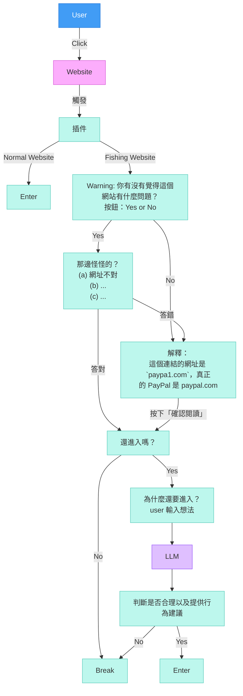

# ScoutNet 產品需求文件 (PRD)

| 版本 | 日期 | 修改人 | 備註 |
| :--- | :--- | :--- | :--- |
| v1.0 | 2026-02-28 14:30 | PM (AI) | 初版草案 |
| v2.0 | 2026-02-28 | Engineering | 移除 SOS、統一受眾為 18 歲以下、更新流程圖 |

## 1. 執行摘要 (Executive Summary)
**ScoutNet** 是一款針對 18 歲以下兒童與青少年設計的 Chrome 瀏覽器擴充功能。不同於傳統家長監護軟體的「強制阻擋」與「後台監控」，ScoutNet 採用「隱私優先」與「引導式學習」的核心理念。

透過 AI 即時分析網頁風險，我們將網路瀏覽轉化為數位素養的學習過程。當偵測到風險時，系統會暫停瀏覽，透過蘇格拉底式的對話引導使用者思考風險，而非單純禁止。

## 2. 產品價值與理念
*   **引導代替限制 (Guidance over Restriction)**：不只是說「不」，而是解釋「為什麼」，並確認使用者理解。
*   **賦能代替監控 (Empowerment over Surveillance)**：目標是培養使用者獨立判斷網路風險的能力，而非單純監視其行為。
*   **透明與隱私 (Transparency & Privacy)**：判斷標準公開透明，且在保護使用者的同時尊重其數據隱私。

## 3. 目標受眾 (Target Audience)
*   **核心使用者**：18 歲以下兒童與青少年。具備基礎閱讀與打字能力，開始頻繁使用網路進行學習或娛樂，但對網路詐騙、霸凌、個資釣魚等風險缺乏警覺。
*   **次要使用者**：家長/監護人。希望保護孩子，但不希望透過高壓監控破壞親子關係。

## 4. 功能需求 (Functional Requirements)

### 4.1. 核心瀏覽流程：預設阻擋與 AI 掃描 (Latency Handling)
為了確保安全性，我們採用「零信任」的載入策略。

*   **FR-001 預設阻擋 (Default Block)**：
    *   使用者輸入 URL 或點擊連結後，畫面需立即被 ScoutNet 的覆蓋層 (Overlay) 遮擋。
    *   **UI 呈現**：畫面中央顯示「ScoutNet 正在幫你探路...」或類似的友善掃描動畫，避免白畫面造成的焦慮。
*   **FR-002 URL 解析與風險查詢**：
    *   系統提取當前 URL。
    *   同時呼叫 **4 個安全 API**（VirusTotal、URLhaus、PhishTank、Google Safe Browsing）進行並行威脅情報查詢。
    *   若無資安風險，進一步呼叫 **Exa AI** 取得網頁內容進行適齡分析。
*   **FR-003 風險判斷與分流**：
    *   **安全 (Safe)**：AI 判斷無風險且內容適合 18 歲以下使用者，Overlay 自動淡出，可正常瀏覽。可考慮在角落顯示一個綠色盾牌圖示表示「安全」。
    *   **釣魚/資安風險 (Path A)**：進入 Featherless AI 釣魚深度分析，生成安全報告。
    *   **不適齡內容 (Path B)**：進入 Featherless AI 內容風險分析，生成安全報告。

### 4.2. 對話引導式學習 (Conversational Guidance)
這是 ScoutNet 的核心差異化功能，目的是「教育」。

*   **FR-004 風險情境生成**：
    *   呼叫 **Featherless AI (Qwen)**，根據偵測到的風險類型（釣魚或不適齡內容），生成針對 18 歲以下使用者易懂的警告文字與引導問題。
*   **FR-005 強制對話層 (Interactive Overlay)**：
    *   **UI**：畫面保持模糊或被遮擋，右側或中央出現對話框。
    *   **互動**：AI 提出情境問題。範例：
        *   **題目**：🔍 你覺得 `allegrolokalnie.pl-oferta-id-133457-kategorie-id-192876.cfd` 這個網址，哪裡「怪怪的」？
            *   (A) 它跟真正的品牌網址長得好像，但有些地方不太一樣 ❌
            *   (B) 它的「尾巴」是 .cfd，但正規網站通常是 .com ❌
            *   (C) 它用數字或符號代替字母（例如用 1 代替 l，0 代替 o） ✅
            *   (D) 以上都是！🎉 ❌
        *   **學習重點**：看到很像知名品牌的網址，一定要「逐字檢查」＋「確認官方網址」！
*   **FR-006 解鎖機制 (Unlock Logic)**：
    *   使用者必須輸入回答。
    *   AI 判斷回答是否展現了「風險意識」。
        *   **通過**：AI 給予肯定（「很棒！你知道這是騙人的。」），Overlay 解除，但在側邊欄保留警示標記。
        *   **未通過**：AI 進一步解釋風險，並可能要求使用者再次確認或直接建議離開。

### 4.3. 第二階段勸阻與教育 (Second-Stage Persuasion)
當使用者看完報告後仍想進入有風險的網站時，啟動第二階段 AI 勸阻。

*   **FR-007 理由輸入**：
    *   使用者需說明為什麼仍想進入該網站。
*   **FR-008 AI 勸阻分析**：
    *   Featherless AI 分析使用者的理由，以同理但堅定的方式回應，包含行為後果警告、同理心對話、一般警告、建議行動與鼓勵訊息。
*   **FR-009 最終決策**：
    *   根據 `is_reasonable` 判斷：
        *   **合理**：允許進入，但保留持續的警示標記。
        *   **不合理**：顯示鼓勵訊息建議離開，但仍保留「堅持進入」選項作為最後手段。

## 5. 技術架構 (Technical Architecture)

### 5.1. 前端 (Client-side)
*   **平台**：Chrome Extension (Manifest V3)
*   **框架**：React + TypeScript (基於現有 Vite 架構)
*   **主要元件**：
    *   `Background Service Worker`：處理 URL 監聽、API 請求轉發。
    *   `Content Script`：負責注入 Overlay、攔截畫面互動。
    *   `Popup/SidePanel`：設定頁面或輔助對話視窗。

### 5.2. AI 與後端服務 (AI & Backend)
*   **安全情報**：VirusTotal、URLhaus、PhishTank、Google Safe Browsing（並行 async 查詢）。
*   **內容檢索**：**Exa AI**（取得網頁真實內容，進行適齡分析）。
*   **生成式 AI 模型**：**Qwen (via Featherless AI)**（生成適合兒童的對話、判斷回答的語意、勸阻分析）。
*   **後端框架**：FastAPI（Python，全 async 架構）。

## 6. 使用者體驗流程 (UX Flow)

1.  **瀏覽請求** → 瀏覽器導航至 URL。
2.  **立即介入** → 顯示「掃描中」全頁遮罩。
3.  **安全掃描** → 4 個安全 API 並行查詢。
4.  **風險分流** →
    *   *(路徑 A: 釣魚/資安風險)* → Featherless AI 深度分析 → 安全報告。
    *   *(路徑 B: 無資安風險)* → Exa AI 取得內容 → Featherless AI 適齡分類。
        *   適合 → 遮罩消失 → 正常瀏覽。
        *   不適合 → 內容風險報告。
5.  **報告互動** → 展示安全報告（含互動問答）→ 使用者作答。
6.  **通過/未通過** →
    *   *(答對)* → 詢問「還要進入嗎？」
    *   *(答錯)* → 解釋正確答案 → 確認閱讀 → 詢問「還要進入嗎？」
7.  **使用者決策** →
    *   *不進入* → 離開。
    *   *要進入* → 輸入理由 → Featherless AI 勸阻分析 → 教育與引導。
8.  **最終結果** →
    *   接受引導 → 離開。
    *   堅持進入 → 放行（附風險標記）。

  
Mermaid Code (舊版參考)

### Mermaid Code
Online Editor: https://mermaid.live/edit

## 7. 開發階段規劃 (Roadmap)

### Phase 1: MVP (目前階段)
*   完成 Chrome Extension 基礎架構。
*   實作「預設阻擋」+ 4 個 Security API + Exa/Qwen API 串接。
*   實作基本的「對話解鎖」邏輯（Prompt Engineering 為重點）。
*   實作第二階段勸阻分析。
*   設定檔：寫死或簡單的 LocalStorage 設定。

### Phase 2: 優化與擴充 (未來規劃)
*   家長儀表板 (Dashboard)：設定黑/白名單，查看攔截紀錄。
*   多模態偵測：不只掃描文字，也透過 AI Vision 掃描圖片風險。
*   年齡分層：針對不同年齡層提供不同語氣與深度的 AI 回應。

---

## 待確認事項 (Open Questions)

1.  **Exa AI 的延遲**：如果 Exa 分析超過 5 秒，我們是否要提供「略過」選項，還是堅持安全性優先，讓使用者等待？
    *   *建議：顯示有趣的 Loading 知識小語，堅持安全性。*
2.  **白名單策略**：常見安全網站（如 google.com、youtube.com）是否跳過掃描，還是至少做快速檢查？
    *   *建議：維護可設定的白名單，搭配快速檢查。*
