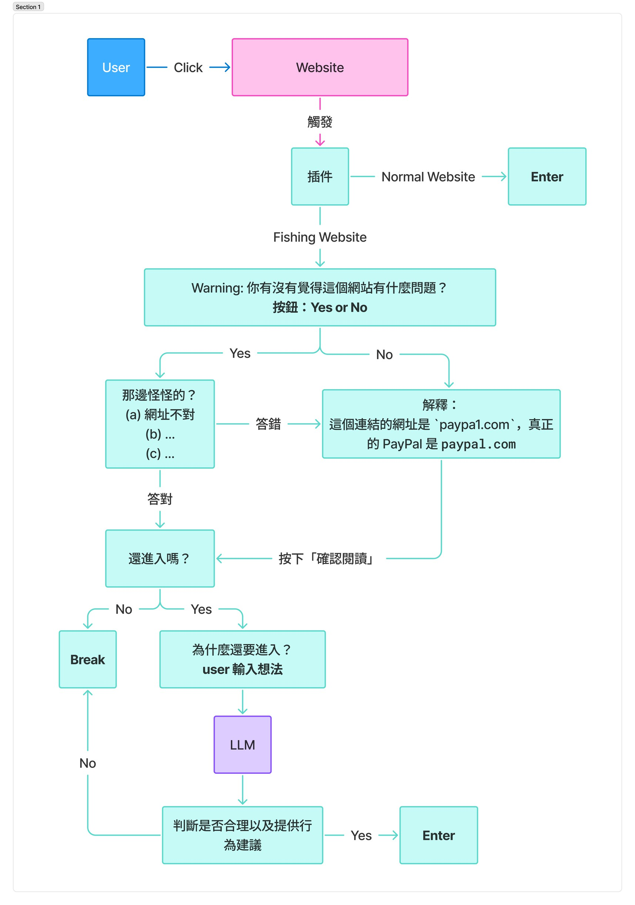
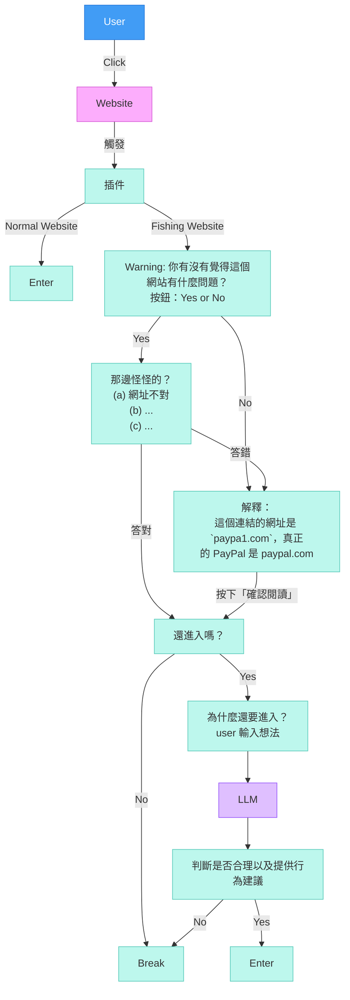

這是一份根據您的構想與補充細節所撰寫的 **ScoutNet 產品需求文件 (PRD)**。這份文件將作為開發團隊（包含前端、後端、AI 整合）的執行藍圖。

---

# ScoutNet 產品需求文件 (PRD)

| 版本 | 日期 | 修改人 | 備註 |
| :--- | :--- | :--- | :--- |
| v1.0 | 2026-02-28 14:30 | PM (AI) | 初版草案 |

## 1. 執行摘要 (Executive Summary)
**ScoutNet** 是一款針對兒童（以 12 歲為首發目標客群）設計的 Chrome 瀏覽器擴充功能。不同於傳統家長監護軟體的「強制阻擋」與「後台監控」，ScoutNet 採用「隱私優先」與「引導式學習」的核心理念。

透過 AI 即時分析網頁風險，我們將網路瀏覽轉化為數位素養的學習過程。當偵測到風險時，系統會暫停瀏覽，透過蘇格拉底式的對話引導兒童思考風險，而非單純禁止。同時配備緊急求救機制，確保兒童在感到威脅時能立即尋求協助。

## 2. 產品價值與理念
*   **引導代替限制 (Guidance over Restriction)**：不只是說「不」，而是解釋「為什麼」，並確認兒童理解。
*   **賦能代替監控 (Empowerment over Surveillance)**：目標是培養兒童獨立判斷網路風險的能力，而非單純監視其行為。
*   **透明與隱私 (Transparency & Privacy)**：判斷標準公開透明，且在保護兒童的同時尊重其數據隱私。

## 3. 目標受眾 (Target Audience)
*   **核心使用者**：12 歲兒童。具備基礎閱讀與打字能力，開始頻繁使用網路進行學習或娛樂，但對網路詐騙、霸凌、個資釣魚等風險缺乏警覺。
*   **次要使用者**：家長/監護人。希望保護孩子，但不希望透過高壓監控破壞親子關係。

## 4. 功能需求 (Functional Requirements)

### 4.1. 核心瀏覽流程：預設阻擋與 AI 掃描 (Latency Handling)
為了確保安全性，我們採用「零信任」的載入策略。

*   **FR-001 預設阻擋 (Default Block)**：
    *   使用者輸入 URL 或點擊連結後，畫面需立即被 ScoutNet 的覆蓋層 (Overlay) 遮擋。
    *   **UI 呈現**：畫面中央顯示「ScoutNet 正在幫你探路...」或類似的友善掃描動畫，避免白畫面造成的焦慮。
*   **FR-002 URL 解析與風險查詢**：
    *   系統提取當前 URL。
    *   呼叫 **Exa AI** 進行網頁內容與風險背景檢索。
*   **FR-003 風險判斷與分流**：
    *   **安全 (Safe)**：AI 判斷無風險，Overlay 自動淡出，使用者可正常瀏覽。可考慮在角落顯示一個綠色盾牌圖示表示「安全」。
    *   **風險 (Risky)**：維持 Overlay 遮擋，進入「對話引導模式」（詳見 4.2）。

### 4.2. 對話引導式學習 (Conversational Guidance)
這是 ScoutNet 的核心差異化功能，目的是「教育」。

*   **FR-004 風險情境生成**：
    *   呼叫 **FeatherAI (Qwen)**，根據 Exa AI 提供的網頁資訊，生成針對 12 歲兒童易懂的警告文字與引導問題。
*   **FR-005 強制對話層 (Interactive Overlay)**：
    *   **UI**：畫面保持模糊或被遮擋，右側或中央出現對話框。
    *   **互動**：AI 提出情境問題。例如：
        *   釣魚網站：「這個網站要求你輸入爸爸媽媽的信用卡號碼，你覺得它為什麼需要這個？」
        *   暴力內容：「這個影片裡的人在做危險的動作，模仿他們會有什麼後果？」
*   **FR-006 解鎖機制 (Unlock Logic)**：
    *   使用者必須輸入回答。
    *   AI 判斷回答是否展現了「風險意識」。
        *   **通過**：AI 給予肯定（「很棒！你知道這是騙人的。」），Overlay 解除，但在側邊欄保留警示標記。
        *   **未通過**：AI 進一步解釋風險，並可能要求使用者再次確認或直接建議離開。

### 4.3. 安心按鈕 (Safety Button / SOS)
兒童主動發起的緊急求救機制。

*   **FR-007 觸發機制**：
    *   瀏覽器擴充功能列或頁面側邊懸浮一顆明顯的「安心按鈕」。
    *   適用情境：遭遇網路霸凌、騷擾訊息、感到不適的內容。
*   **FR-008 自動截圖與通報**：
    *   點擊後，系統自動擷取當前瀏覽器畫面（包含 URL）。
    *   系統將截圖與預設求救訊息（例如：「我這裡遇到了麻煩，請幫幫我。」）寄送至設定好的家長/監護人 Email。
*   **FR-009 觸發後回饋**：
    *   畫面顯示「已通知爸爸/媽媽，別擔心，我們在這裡。」給予心理支持。

## 5. 技術架構 (Technical Architecture)

### 5.1. 前端 (Client-side)
*   **平台**：Chrome Extension (Manifest V3)
*   **框架**：React + TypeScript (基於現有 Vite 架構)
*   **主要元件**：
    *   `Background Service Worker`：處理 URL 監聽、API 請求轉發。
    *   `Content Script`：負責注入 Overlay、攔截畫面互動、執行 DOM 截圖。
    *   `Popup/SidePanel`：設定頁面或輔助對話視窗。

### 5.2. AI 與後端服務 (AI & Backend)
*   **搜尋/上下文檢索**：**Exa AI** (用於理解網頁真實內容，而非僅依賴關鍵字)。
*   **生成式 AI 模型**：**Qwen (via FeatherAI)** (用於生成適合兒童的對話、判斷兒童回答的語意)。
*   **郵件服務**：SMTP 服務或第三方 Email API (如 SendGrid/Resend) 用於發送 SOS 郵件。

## 6. 使用者體驗流程 (UX Flow)
1.  **瀏覽請求** -> 瀏覽器導航至 `URL`。
2.  **立即介入** -> 顯示「掃描中」全頁遮罩。
3.  **AI 判斷** ->
    *   *(路徑 A: 安全)* -> 遮罩消失 -> 正常瀏覽。
    *   *(路徑 B: 危險)* -> 遮罩轉為「引導對話框」 -> 顯示風險提示 -> 提問。
4.  **互動** -> 兒童回答問題。
5.  **判定** ->
    *   *(回答正確)* -> 解鎖網頁 (或建議關閉)。
    *   *(回答錯誤)* -> 給予解釋 -> 再次提問或強制阻擋。
6.  **緊急情況** -> 隨時點擊「安心按鈕」 -> 截圖發送 -> 確認回饋。

:::spoiler
### User Flow Diagram

### Mermaid Code
Online Editor: https://mermaid.live/edit

:::

## 7. 開發階段規劃 (Roadmap)

### Phase 1: MVP (目前階段)
*   完成 Chrome Extension 基礎架構。
*   實作「預設阻擋」+「Exa/Qwen API 串接」。
*   實作基本的「對話解鎖」邏輯 (Prompt Engineering 為重點)。
*   實作「安心按鈕」的截圖與 Email 發送功能。
*   設定檔：寫死或簡單的 LocalStorage 設定 (接收通知的 Email)。

### Phase 2: 優化與擴充 (未來規劃)
*   家長儀表板 (Dashboard)：設定黑/白名單，查看攔截紀錄。
*   多模態偵測：不只掃描文字，也透過 AI Vision 掃描圖片風險。
*   年齡分層：針對 8歲、15歲提供不同語氣與深度的 AI 模型。

---

## 待確認事項 (Open Questions)

在開始開發前，作為 PM 我需要與您（工程團隊/Stakeholder）確認以下執行細節，您可以在開發過程中隨時決定：

1.  **Email 發送方式**：我們要使用客戶端的 `mailto:` 喚起系統郵件（簡單但需兒童手動按發送），還是透過後端 API 靜默發送（體驗較好但需要架設簡單的後端 Server 或 Serverless Function）？
    *   *建議 MVP：使用 Serverless Function (如 Vercel Functions) 轉發 Email API，避免將 API Key 暴露在前端。*
2.  **Exa AI 的延遲**：如果 Exa 分析超過 5 秒，我們是否要提供「略過」選項，還是堅持安全性優先，讓使用者等待？
    *   *建議：顯示有趣的 Loading 知識小語，堅持安全性。*
3.  **截圖隱私**：SOS 截圖是否要先經過模糊處理再發送，還是傳送原圖？
    *   *建議：傳送原圖，因為這是緊急求救，家長需要看清楚發生什麼事。*
